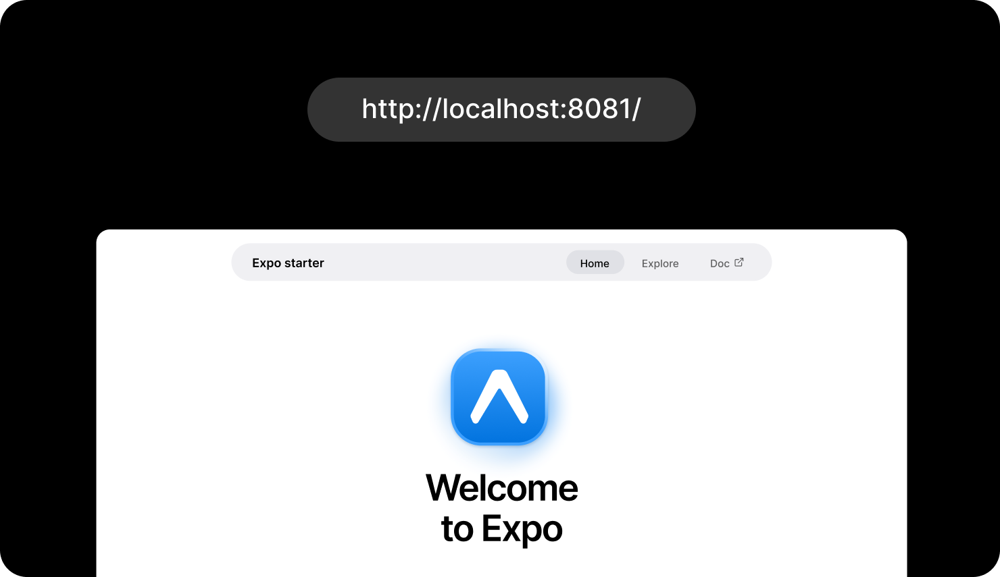

# SendAm

SendAm is a mobile marketplace for same-city errands, market runs, and on-demand delivery coordination. It connects people who need items sourced or transported with local runners who know the city, understand the markets, and can fulfill errands quickly. This app is the customer-facing and operations-facing mobile client built with Expo, React Native, and Expo Router.

At a product level, SendAm sits at the intersection of commerce, logistics, and trusted neighborhood labor. A user can discover runners, post a job, fund a wallet, track the errand as it progresses, chat with the assigned runner, and receive notifications throughout the lifecycle of the request.

This repository contains the frontend client. It expects a separate backend for auth, runner discovery, wallet operations, notifications, chat, and errand lifecycle management.

## Why This Product Exists

In dense urban markets, getting something done often means knowing who to call, where to source from, which market to trust, and how to coordinate delivery under time pressure. SendAm packages that informal network into software.

The value proposition visible in this codebase is straightforward:

- Consumers get a faster way to source and move goods across town.
- Runners get a structured way to monetize local knowledge and availability.
- The platform gets transaction visibility, communication tooling, and a repeatable operational workflow.

For an investor or product stakeholder, the app demonstrates a credible service loop:

1. Acquire users through a simple onboarding and auth funnel.
2. Convert demand into structured errands.
3. Route demand toward available runners.
4. Keep both sides engaged through live status, messaging, and notifications.
5. Capture wallet activity and repeat usage through stored methods and transaction history.

## Product Snapshot

### Core user value

- Post errands for goods pickup, market sourcing, food delivery, or custom requests.
- Discover nearby runners by market, proximity, and availability.
- Track live errand progress through clearly defined delivery states.
- Chat directly with runners inside the job context.
- Manage wallet balance, saved payment methods, and transaction history.
- Receive push notifications and in-app alerts for important updates.

### Business-facing signals already present in the app

- Marketplace structure with two-sided participation.
- Geo-aware logistics flow through pickup and dropoff coordinates.
- Runner discovery and hire intent.
- Wallet and payment primitives that support monetization.
- Notification and messaging infrastructure that supports retention.
- Branded visual identity instead of raw prototype scaffolding.

## Screenshots

Replace these placeholders with real product images when available. The placeholders currently use the provided asset.

### Onboarding



### Authentication


### Home


### Runner Discovery


### Errand Creation


### Live Tracking


### Messaging


### Wallet


## Experience Overview

The current app flow reads like this:

1. A user lands on a branded splash screen and onboarding sequence.
2. The user signs up, logs in, or completes OTP verification.
3. The authenticated user enters a tab-based dashboard.
4. From there they can search runners, post a new errand, review alerts, or manage their profile.
5. Once an errand is created, they can track its status, contact the runner, and review financial activity.

This is already more than a static showcase. The app contains the wiring for a real operational product.

## Technical Overview

### Stack

- Expo SDK `55`
- React `19`
- React Native `0.83`
- TypeScript
- Expo Router for file-based navigation
- Expo Secure Store for token persistence
- AsyncStorage for lightweight local caching
- Expo Notifications for push registration and alert handling
- Expo Location for coordinate capture and address autofill
- Expo Image for performant image rendering
- Moti for motion and refresh interactions
- Lucide React Native for iconography

### Product architecture in plain terms

- `src/context/AuthContext.tsx`
  Handles session boot, token storage, profile hydration, refresh-token flow, and route guards.
- `src/context/ThemeContext.tsx`
  Applies light or dark mode based on the signed-in user's preference.
- `src/constants/api.ts`
  Centralizes backend endpoint construction for auth, errands, wallet, chat, notifications, runner profiles, and search.
- `src/app`
  Contains all file-based routes.
- `src/components/ui`
  Houses shared primitives such as buttons, alerts, cards, inputs, custom tab bar, and refresh behavior.

## What the App Already Supports

### 1. Authentication and session management

The app supports:

- Signup
- Login
- OTP verification
- Refresh-token recovery
- Session persistence across app restarts
- Protected routing
- Sign-out cleanup

This matters because it moves the app beyond brochureware. There is real account-state handling and gated navigation.

### 2. Marketplace home dashboard

The home experience in `src/app/(tabs)/index.tsx` pulls together:

- Active errands
- Nearby runners
- Unread notifications
- Profile entry
- Pull-to-refresh account and marketplace state

This is the operational center of the app and the strongest signal that the product is being designed around repeat usage, not one-off transactions.

### 3. Runner discovery

`src/app/(tabs)/search.tsx` supports:

- Query-based runner search
- Market-based filtering
- Proximity-style filtering
- Search trend recording
- Recent local searches saved to storage
- Navigation into runner profiles

This is an important marketplace layer because demand quality improves when users can browse supply with context.

### 4. Errand creation

`src/app/new-errand.tsx` includes:

- Category selection for package, market, food, or custom jobs
- Pickup and dropoff capture
- GPS-assisted autofill using `expo-location`
- Base fee and urgency logic
- Optional targeted runner support in the request payload
- Broadcast submission to the backend

This is the monetizable action in the product. It is the main conversion event.

### 5. Live errand tracking

`src/app/waka/[id].tsx` provides:

- Server-backed errand detail retrieval
- Step-based status mapping
- Runner summary display
- Price and route visibility
- Cancellation flow

This gives users transparency after checkout or booking, which is critical for trust in a logistics product.

### 6. Messaging

Messaging is implemented through:

- `src/app/(tabs)/messages.tsx`
- `src/app/conversation/[id].tsx`

The implementation uses:

- HTTP for conversation list and message history
- HTTP for send actions
- WebSocket for live message delivery

That hybrid approach is practical and product-appropriate. It supports persistence while still enabling real-time interaction.

### 7. Notifications

Notification functionality is visible in:

- `src/utils/notifications.ts`
- `src/context/AuthContext.tsx`
- `src/app/notifications.tsx`
- `src/app/notification/[id].tsx`

The app already handles:

- Push permission requests
- Expo push token registration
- Notification channel setup on Android
- Push-token sync to the backend
- In-app alert listing
- Mark-as-read and clear-all actions
- Navigation from alerts into relevant screens

### 8. Wallet and payments

Profile and finance tooling under `src/app/profile` includes:

- Wallet balance display
- Funding flow
- Payment method listing and deletion
- Transaction history
- Transaction detail views
- Dispute entry points

This is notable from an investor perspective because it shows the beginnings of a closed-loop transaction system, and from a developer perspective because the API integration surface is already shaped.

## Route Map

### Public routes

- `src/app/index.tsx`
  Splash screen that transitions into onboarding.
- `src/app/onboarding.tsx`
  Brand and product education flow.
- `src/app/auth.tsx`
  Login, signup, OTP verification, and resend logic.

### Protected tab routes

- `src/app/(tabs)/index.tsx`
  Dashboard and active marketplace overview.
- `src/app/(tabs)/search.tsx`
  Runner search and market discovery.
- `src/app/(tabs)/messages.tsx`
  Conversation list and unread filtering.
- `src/app/(tabs)/profile.tsx`
  User identity, wallet snapshot, and settings entry.

### Protected stack routes

- `src/app/new-errand.tsx`
- `src/app/waka/[id].tsx`
- `src/app/waka/history.tsx`
- `src/app/runner/[id].tsx`
- `src/app/runners/all.tsx`
- `src/app/conversation/[id].tsx`
- `src/app/notifications.tsx`
- `src/app/notification/[id].tsx`
- `src/app/profile/*`
- `src/app/dispute/create.tsx`
- `src/app/privacy.tsx`
- `src/app/terms.tsx`

## Design and UX Direction

The app does not look like an untouched Expo scaffold. It has a clear visual system defined in `src/constants/design.ts`.

Notable traits:

- Heavy borders and hard shadows
- Square corners
- High-contrast orange, green, yellow, and black palette
- Strong heading typography through `Outfit`
- Clean body typography through `Plus Jakarta Sans`

That matters for two reasons:

- Investors can see deliberate brand direction rather than raw utility screens.
- Developers can see where the design tokens live and how to extend them consistently.

## Backend Contract Surface

The client currently points to a hard-coded local backend in `src/constants/api.ts`:

```ts
const API_URL = 'http://172.20.10.9:8000/api/v1';
```

The app expects backend support for these domains:

- Auth
- User profile
- Runner discovery
- Errand creation and status updates
- Wallet balances and transactions
- Payment methods
- Notifications
- Chat history and real-time messaging
- Search recording and trending responses

### Endpoint groups represented in the client

- `AUTH`
- `WAKA`
- `WALLET`
- `PAYMENT_METHODS`
- `MESSAGES`
- `NOTIFICATIONS`
- `RUNNER`
- `SEARCH`

For a developer joining the project, `src/constants/api.ts` is the fastest place to understand the backend surface area.

## Developer Notes

### Local setup

Prerequisites:

- Node.js 18 or newer
- npm
- Expo-compatible simulator or device
- Access to the matching backend instance

Install and run:

```bash
npm install
npm run start
```

Useful scripts:

```bash
npm run android
npm run ios
npm run web
npm run lint
```

### Important implementation notes

- Auth state is global and context-driven.
- Tokens are stored in `expo-secure-store`.
- Cached user and search state use `AsyncStorage`.
- WebSocket chat depends on the backend host being reachable from the device.
- Push notifications require a valid Expo project ID in `app.json`.
- Location-based autofill requires foreground location permission.

### Files worth reading first

- `src/context/AuthContext.tsx`
- `src/constants/api.ts`
- `src/app/_layout.tsx`
- `src/app/(tabs)/index.tsx`
- `src/app/new-errand.tsx`
- `src/app/waka/[id].tsx`
- `src/app/conversation/[id].tsx`
- `src/app/profile/payment.tsx`

## Current Strengths

- The app is already organized around a coherent service loop.
- Core marketplace surfaces are implemented, not just mocked in isolation.
- Session handling and navigation guards are in place.
- Real-time communication primitives exist.
- Wallet and payment concepts are already part of the user experience.
- The visual system is strong enough to communicate product identity.

## Current Gaps and Opportunities

- API configuration is hard-coded instead of environment-driven.
- The repository does not yet document backend setup or response contracts.
- There is no formal automated test suite configured.
- Some routes still rely on partial placeholder assumptions or backend-specific response shapes.
- The direct runner-hire route can be tightened further by passing target runner params end-to-end.

These are normal next-stage product engineering tasks, not signs of an empty codebase.

## Bottom Line

For an investor, this repository shows a product with a real marketplace thesis, visible logistics workflow, embedded payments direction, and retention-oriented surfaces like messaging and notifications.

For a developer, it shows a workable Expo Router codebase with clear route boundaries, centralized auth and API wiring, reusable UI primitives, and a backend integration surface that is already broad enough to support a meaningful service.
